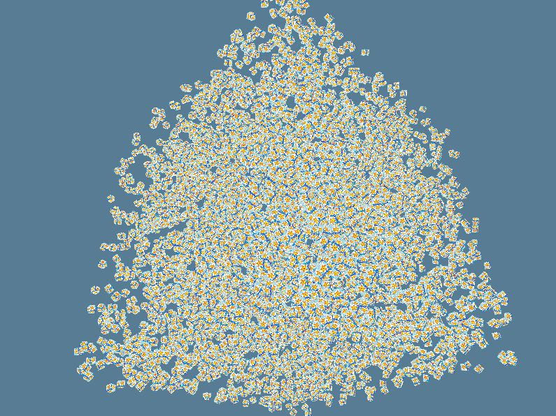
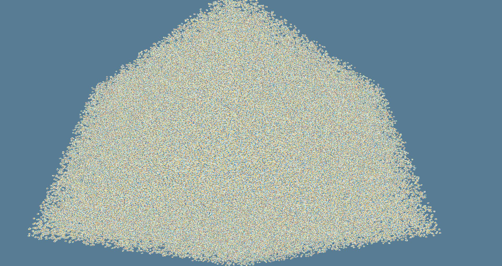

# Instanced Drawing

So, now that we have a few cubes on the screen, what could be a more
logical step than drawing **many, many more cubes on the screen**?!
Well, the naive way to do this would be to just issue many more draw
calls, and indeed, since we are using push constants to change the
transformations, this would work. However, once you get to a few
thousand objects, this would start to slow down quite a bit, even for
something as simple as a textured cube, especially on less powerful
desktop and mobile GPUs. This is *less* of a problem when using one of
Vulkan/DX12/Metal than it was in the past with OpenGL, but it can still
bog down form many draw calls.

The solution to this problem is something called *instanced drawing*.
Whenever we've made a draw call, we've passed *two* ranges, one for 
vertices and one for *instances*. Until this point, we've sort of
glossed over what this "instances" argument means, but that changes
now!

As you know, the Vertex Shader is run for every one of the vertexes in 
the bound vertex buffer(s). The data from the vertex buffer gets sent in
to "attributes" in the shader and this data changes for each vertex 
based on the stride that we told it when creating our pipeline. What 
we also gave it was a "rate," but we also sort of glossed over this in 
the past. We have been inputting a "rate" of 0, which means that the 
data in this vertex buffer should advance *for every vertex*. However, 
if we input a rate of 1, then we are telling it that the data in this 
buffer should advance only every *instance*.

If we do a draw call over 50 vertices and 5 instances, it will 
essentially repeat going over all 50 vertices 5 times, resetting all 
"rate 0" vertex buffers back to the beginning for each instance. 
However, all "rate 1" vertex buffers will *stay the same for all the 
vertices of each instance*, but get *advanced once in between each 
instance*.

Basically, we can get data which stays the same between each 
*instance* of an object. This can often be super useful, as we'll
explore in this tutorial!

## A maximum number of instances

As we'll soon discover, using this method *does* come with some
limitations. One of them is that we'll need to know ahead of time
the maximum number of instances we want to be able to draw, and we'll
need to allocate a buffer big enough to fit all the data for those
maximum number of instances. Luckily, our per-instance data is
relatively small, so it's not too big a deal.

For now, we'll just choose an arbitrary but fairly large number like
5000. Just above where we have our vertex shader source, we'll put

```rust
pub const MAX_CUBES: usize = 5000;
```

## Modifying the shader

Okay, so the next thing we'll do is modify our vertex shader a little
bit. The first thing we'll do is change our push constant block
slightly. Instead of passing in a fully precomputed 
model-view-projection matrix all in one, we're now going to precompute
the view-projection matrix in our push constants and then pass in
*a new model matrix per instance* and combine the two in the vertex
shader.

```glsl
layout (push_constant) uniform PushConsts {
  mat4 view_proj;
} push;
```

Next, we're going to add *four* new vertex attributes. We need four
because each attribute location can only store up to a maximum of a
`vec4` of data, and we want to pass in a `mat4` instead. Actually, in
theory, the Vulkan spec supports just defining one attribute at the
first of the four locations with type `mat4` and it will automatically
fetch the data from the next four attribute locations, but this isn't
yet translated properly to dx12, so we'll hold off on that for now.
So, just below our `position` and `vert_uv` input attributes, we'll add

```glsl
layout (location = 2) in vec4 model_col1;
layout (location = 3) in vec4 model_col2;
layout (location = 4) in vec4 model_col3;
layout (location = 5) in vec4 model_col4;
```

And finally update the actual calculation to use this new setup like
so

```glsl
void main()
{
  mat4 model = mat4(
    model_col1,
    model_col2,
    model_col3,
    model_col4);
  gl_Position = push.view_proj * model * vec4(position, 1.0);
  frag_uv = vert_uv;
}
```

Okay, that's all we need to do in the shaders!

## Adding instance buffers to HalState

The next thing we need to do is add a new piece of `HalState` which
we'll call `cube_instances`

```rust
pub struct HalState {
    //...
    cube_instances: Vec<BufferBundle<back::Backend, back::Device>>,
    //...
}
```

The reason we want a `Vec` of `BufferBundle`s is because we are
actually going to use not just *one* instance buffer, but one instance
buffer *per frame* in flight. The reason we do this is so that we can
guarantee that we are not attempting to write new data into the buffer
to update the transformations of the cubes while another frame is
trying to read from that data on the GPU.

Next we'll actually create those buffers in `HalState`'s `new`, just
below where we create and upload to the index buffer:

```rust
    let mut cube_instances = Vec::new();
    for _ in 0..frames_in_flight {
      cube_instances.push(BufferBundle::new(
        &adapter,
        &device,
        size_of::<f32>() * 16 * MAX_CUBES,
        BufferUsage::VERTEX,
      )?);
    }
```

Note that the size is 16 `f32`s (the size of a 4x4 matrix) times the
max number of cubes we defined earlier, and that the usage is 
VERTEX. Also note that our `BufferBundle` already *by default* and
*only* (for now) supports creating a `CPU_VISIBLE` buffer. This is
usually what you want for an instance buffer, as you'll be wanting to
write data to it frequently. However, we'll also want to transition to
using to `DEVICE_LOCAL` memory for most of our normal vertex buffers,
which will likely *not* be changed and therefore are much better off
living in the high speed, on-device memory.


Oh, and don't forget to clean them up either! Right after we clean
up the other cube vertex and index buffers,

```rust
for buf in self.cube_instances.drain(..) {
    buf.manually_drop(self.device.deref());
}
```

## Adding new vertex buffer and attributes to pipeline

The next thing we'll do is modify our pipeline to add another vertex
buffer and our four new vertex attributes.

In the `create_pipeline` function, we'll modify the creation of the
`vertex_buffers` to add a second one

```rust
let vertex_buffers: Vec<VertexBufferDesc> = vec![
    VertexBufferDesc {
        binding: 0,
        stride: size_of::<Vertex>() as ElemStride,
        rate: 0,
    },
    // Add another vertex buffer with stride of a 4x4 matrix and rate 1
    // meaning it advances once per instance rather than per vertex
    VertexBufferDesc {
        binding: 1,
        stride: (size_of::<f32>() * 16) as ElemStride,
        rate: 1,
    }
];
```

And add four new attributes to `attributes`

```rust
let mut attributes: Vec<AttributeDesc> = Vertex::attributes();

// We need 4 new attributes, one for each column of the matrix we want to put in.
attributes.push(AttributeDesc {
    location: 2,
    binding: 1,
    element: Element {
        format: Format::Rgba32Float,
        offset: 0,
    },
});
attributes.push(AttributeDesc {
    location: 3,
    binding: 1,
    element: Element {
        format: Format::Rgba32Float,
        offset: 16,
    },
});
attributes.push(AttributeDesc {
    location: 4,
    binding: 1,
    element: Element {
        format: Format::Rgba32Float,
        offset: 32,
    },
});
attributes.push(AttributeDesc {
    location: 5,
    binding: 1,
    element: Element {
        format: Format::Rgba32Float,
        offset: 48,
    },
});
```

Note the `binding` which matches the `VertexBufferDesc` above it,
as well as the `location`s which match with what we added to 
our shaders. Also be careful to use the correct `format` and
`offset`s into each `stride` in the buffer.

## Uploading data and drawing it

Now we'll drop all the way down to `draw_cubes_frame`. The first thing
we'll do is get a mutable reference to the corresponding instance
buffer just after we get the current image index.

```rust
let cube_instance_buf = &mut self.cube_instances[i_usize];
```

Next we'll write the instance data into the instance buffer for each
cube which we are passed in, up to the max number of cubes. This
process is pretty similar to other writing we've done to CPU visible
buffers in the past.

```rust
// Since we just waited for the previous submission's fence we know we can write data to the buffer
// We write each model matrix given (up to a max of MAX_CUBES because that's what we allocated space for)
unsafe {
    let mut data_target = self.device
        .acquire_mapping_writer(&cube_instance_buf.memory, 0..cube_instance_buf.requirements.size)
        .map_err(|_| "Failed to acquire an instance buffer mapping writer!")?;
    let stride = 16; // 16 floats = one 4x4 matrix
    for i in 0..models.len().min(MAX_CUBES) {
        data_target[i*stride..(i+1)*stride].copy_from_slice(&models[i].data);
    }
    self.device
        .release_mapping_writer(data_target)
        .map_err(|_| "Couldn't release an instance buffer mapping writer!")?;
}
```

Next, we'll modify our command recording. First, we'll take out the
loop that previously existed so we only have one each of the
`push_graphics_constants` and `draw_indexed` commands. We'll also
change our `push_graphics_constants` to only pass in the
`view_projection` matrix, and delete the old math that calculated
the full MVP matrix.

```rust
encoder.push_graphics_constants(
    &self.pipeline_layout,
    ShaderStageFlags::VERTEX,
    0,
    cast_slice::<f32, u32>(&view_projection.data)
        .expect("this cast never fails for same-aligned same-size data"),
);
```

And finally, change our draw call to draw the correct number of
vertices *and* instances.

```rust
encoder.draw_indexed(0..36, 0, 0..models.len().min(MAX_CUBES) as u32);
```

## Done! ... Almost

Okay! Now if you start it, you should see... the same thing as the
last lesson! Okay, well... nice, but we wanted *more cubes*! Alright,
well, to do that we'll bring in the `rand` crate and spice up our
cube generation just a little bit.

## Getting Random

First in our `Cargo.toml`

```toml
rand = "0.6"
```

Then, near the top of our rust file,

```rust
use rand::prelude::*;
```

Next, we'll change the "physics" rotation code a bit, as it gets...
*really* fast when you increase the number of cubes being shown.

```rust
let r = ONE_SIXTIETH * 30.0 * (i as f32 + 1.0) / MAX_CUBES as f32;
```

Next, we'll change our cube generation code a bit. Instead of
manually defining 6 cubes, we'll generate cubes up to our defined
`MAX_CUBES` and distribute them randomly into an area proportionate
to the number of them.

```rust
let mut cubes = Vec::new();
let mut rng = rand::thread_rng();
for _ in 0..MAX_CUBES {
    cubes.push(
        glm::translate(
            &glm::identity(),
            &((MAX_CUBES as f32).cbrt() * 3.0 * glm::vec3(rng.gen::<f32>(), rng.gen::<f32>(), rng.gen::<f32>()))
        )
    );
}
LocalState {
    //...
    cubes,
    //...
}
```

You'll notice that the area we're distributing the cubes into is a 
cube with each side as `cubert(MAX_CUBES) * 3.0`. This means that, on
average, since each cube is one unit in size, there will be one cube
distributed every 3 units. Feel free to play around with the scalar
multiplication if you want a tighter or more spread distribution.

## Change the projection matrix

Finally, we'll need to change the perspective matrix a bit to make the
'far' plane further away, or else we'll lose some cubes off the far
clipping plane!

```rust
let mut temp = glm::perspective_lh_zo(800.0 / 600.0, f32::to_radians(50.0), 0.1, 1000.0);
```

Now you should get something like this



Which, okay, that's cool, but how high can we go?! I've had success
with 200,000 cubes on my own machine, but you might be able to go 
higher!



Yeah, that's a lot of cubes...